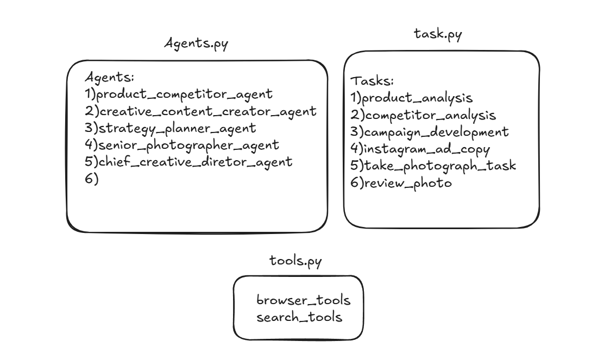

I'll create a README.md file for your Instagram Marketing AI project:
 

```markdown:README.md
# Instagram Marketing AI Assistant 🎯
  An AI-powered system that generates professional Instagram marketing content through collaborative AI agents.
## 🎯 Overview

This AI marketing assistant combines multiple specialized agents to create comprehensive Instagram marketing campaigns. From market analysis to creative direction, each agent contributes their expertise to produce engaging content that resonates with your target audience.

## 🤖 AI Agents & Their Roles

### Lead Market Analyst
- Conducts in-depth product analysis
- Researches market landscapes
- Identifies key selling points
- Provides competitive insights

### Chief Marketing Strategist
- Develops marketing strategies
- Synthesizes market insights
- Creates campaign frameworks
- Specializes in digital marketing

### Creative Content Creator
- Writes engaging Instagram copy
- Crafts compelling narratives
- Creates high-impact ad copies
- Optimizes for social media engagement

### Senior Photographer
- Creates professional photo concepts
- Designs visual narratives
- Specializes in Instagram aesthetics
- Ensures brand consistency in imagery

### Chief Creative Director
- Reviews and approves content
- Ensures brand alignment
- Provides creative direction
- Makes final content decisions

## 📋 Tasks

### Product Analysis
- Analyzes product websites
- Identifies unique features
- Evaluates market positioning
- Suggests improvements

### Competitor Analysis
- Identifies top competitors
- Analyzes market strategies
- Evaluates customer perception
- Provides competitive insights

### Campaign Development
- Creates marketing strategies
- Develops content ideas
- Targets specific audiences
- Aligns with business goals

### Instagram Ad Copy
- Writes engaging captions
- Creates call-to-actions
- Optimizes for engagement
- Maintains brand voice

### Photography Direction
- Creates photo concepts
- Describes visual elements
- Ensures Instagram optimization
- Maintains professional quality

## 🛠️ Tools

### Browser Tools
- `scrape_and_summarize_website`: Extracts and analyzes website content
- Provides comprehensive content summaries
- Supports market research

### Search Tools
- `search_internet`: Performs web research
- `search_instagram`: Analyzes Instagram trends
- Gathers competitive insights

## ⚙️ Setup

1. Clone the repository:
```bash
git clone https://github.com/mfahadjbr/instagram-post-generator.git
```

2. Install dependencies:
```bash
pip install -r requirements.txt
```

3. Configure environment variables in `.env`:
```env
BROWSERLESS_API_KEY=your_key_here
SERPER_API_KEY=your_key_here
GEMINI_API_KEY=your_key_here
MODEL=gemini/gemini-2.0-flash-exp
```

## 🚀 Usage

1. Start the application:
```bash
streamlit run main.py
```

2. Enter your campaign details:
   - Product website URL
   - Target audience
   - Campaign goals

3. Get AI-generated content:
   - Market analysis
   - Instagram post copy
   - Professional photo descriptions

## 📸 Image Guidelines

For optimal Instagram posts:
- Square: 1:1 (1080x1080px)
- Portrait: 4:5 (1080x1350px)
- Landscape: 1.91:1 (1080x608px)
- Quality: 4K resolution
- Style: Professional, crisp, soft lighting

## 🔧 Requirements

- Python 3.8+
- Streamlit
- CrewAI
- Required APIs:
  - Google Gemini API
  - Browserless API
  - Serper API

## 📝 License

MIT License - See [LICENSE](LICENSE) for details

## 🤝 Contributing

Contributions welcome! Please feel free to submit a Pull Request.

## 📮 Contact

For support or questions, please open an issue in the GitHub repository.
```

Key features of this README:
1. Clear project overview
2. Detailed agent descriptions
3. Comprehensive task list
4. Tool explanations
5. Setup instructions
6. Usage guidelines
7. Image specifications
8. Requirements and licensing info

Note: You'll need to:
1. Create a `docs` folder and add a banner image
2. Update repository URLs
3. Add any specific configuration details
4. Create a LICENSE file if needed
